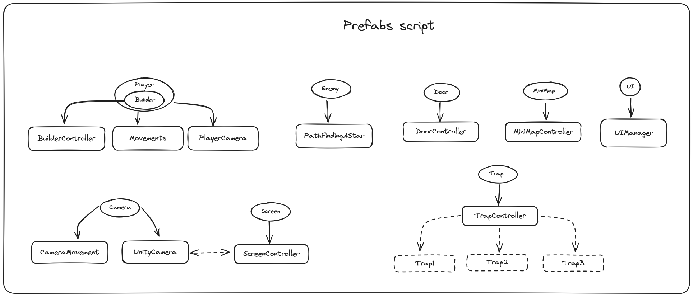
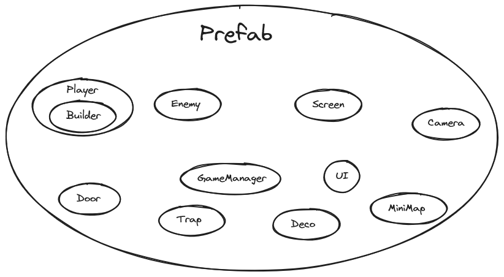
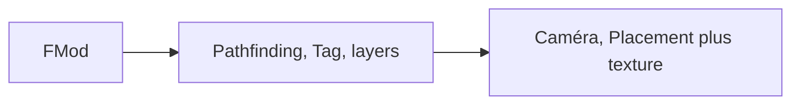
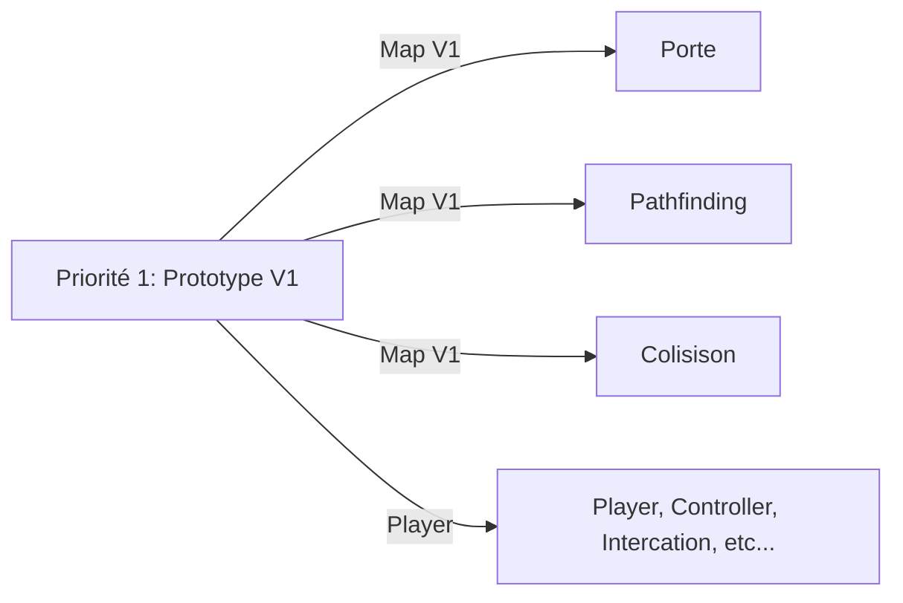
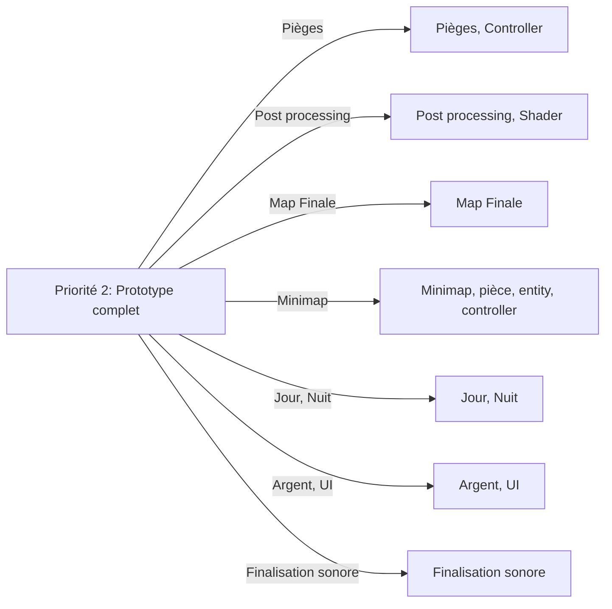

# UPsiJam4

## Entity relationship

## Milestones

### Priorité 0: Proof of concept

1. FMod
2. Pathfinding, Tag, layers
3. Caméra, Placement plus texture  

### Priorité 1: Prototype V1

1. Map V1
   1. Porte
   2. Pathfinding
   3. Colisison
2. Player, Controller, Intercation, etc...

### Priorité 2: Prototype complet

1. Pièges, Controller
2. Post processing, Shader
3. Map Finale
4. Minimap, pièce, entity, controller
5. Jour, Nuit
6. Argent, UI
7. Finalisation sonore

